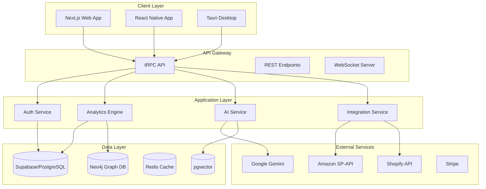

# Ignitabull Technical Architecture

## Overview

This document provides detailed technical specifications for the Ignitabull platform, including database schemas, API design, infrastructure configuration, and implementation guidelines.

## Table of Contents

1. [System Architecture](#system-architecture)
2. [Database Design](#database-design)
3. [API Architecture](#api-architecture)
4. [Authentication & Security](#authentication--security)
5. [Real-time Features](#real-time-features)
6. [AI & ML Pipeline](#ai--ml-pipeline)
7. [Integration Architecture](#integration-architecture)
8. [Deployment & Infrastructure](#deployment--infrastructure)
9. [Performance Optimization](#performance-optimization)
10. [Monitoring & Observability](#monitoring--observability)

## System Architecture

### High-Level Architecture



## Database Design

### Supabase (PostgreSQL) Schema

#### Users & Authentication

```sql
-- Enable UUID extension
CREATE EXTENSION IF NOT EXISTS "uuid-ossp";

-- Enable pgvector for AI embeddings
CREATE EXTENSION IF NOT EXISTS vector;

-- Organizations table
CREATE TABLE organizations (
    id UUID PRIMARY KEY DEFAULT uuid_generate_v4(),
    name TEXT NOT NULL,
    slug TEXT UNIQUE NOT NULL,
    subscription_tier TEXT NOT NULL DEFAULT 'starter',
    subscription_status TEXT NOT NULL DEFAULT 'trialing',
    created_at TIMESTAMP WITH TIME ZONE DEFAULT TIMEZONE('utc', NOW()),
    updated_at TIMESTAMP WITH TIME ZONE DEFAULT TIMEZONE('utc', NOW())
);

-- Users table (extends Supabase auth.users)
CREATE TABLE profiles (
    id UUID PRIMARY KEY REFERENCES auth.users(id) ON DELETE CASCADE,
    organization_id UUID REFERENCES organizations(id) ON DELETE CASCADE,
    email TEXT UNIQUE NOT NULL,
    full_name TEXT,
    role TEXT NOT NULL DEFAULT 'member',
    avatar_url TEXT,
    created_at TIMESTAMP WITH TIME ZONE DEFAULT TIMEZONE('utc', NOW()),
    updated_at TIMESTAMP WITH TIME ZONE DEFAULT TIMEZONE('utc', NOW())
);

-- Row Level Security
ALTER TABLE profiles ENABLE ROW LEVEL SECURITY;
ALTER TABLE organizations ENABLE ROW LEVEL SECURITY;

-- Policies
CREATE POLICY "Users can view their own profile" ON profiles
    FOR SELECT USING (auth.uid() = id);

CREATE POLICY "Users can update their own profile" ON profiles
    FOR UPDATE USING (auth.uid() = id);

CREATE POLICY "Users can view their organization" ON organizations
    FOR SELECT USING (
        id IN (SELECT organization_id FROM profiles WHERE id = auth.uid())
    );
```

#### Integrations

```sql
-- Platform integrations
CREATE TABLE integrations (
    id UUID PRIMARY KEY DEFAULT uuid_generate_v4(),
    organization_id UUID REFERENCES organizations(id) ON DELETE CASCADE,
    platform TEXT NOT NULL, -- 'amazon', 'shopify', etc.
    name TEXT NOT NULL,
    credentials JSONB NOT NULL, -- Encrypted
    settings JSONB DEFAULT '{}',
    status TEXT NOT NULL DEFAULT 'active',
    last_sync_at TIMESTAMP WITH TIME ZONE,
    created_at TIMESTAMP WITH TIME ZONE DEFAULT TIMEZONE('utc', NOW()),
    updated_at TIMESTAMP WITH TIME ZONE DEFAULT TIMEZONE('utc', NOW()),
    UNIQUE(organization_id, platform, name)
);

-- Sync logs
CREATE TABLE sync_logs (
    id UUID PRIMARY KEY DEFAULT uuid_generate_v4(),
    integration_id UUID REFERENCES integrations(id) ON DELETE CASCADE,
    sync_type TEXT NOT NULL, -- 'orders', 'products', 'customers'
    status TEXT NOT NULL, -- 'pending', 'running', 'completed', 'failed'
    started_at TIMESTAMP WITH TIME ZONE DEFAULT TIMEZONE('utc', NOW()),
    completed_at TIMESTAMP WITH TIME ZONE,
    records_processed INTEGER DEFAULT 0,
    error_message TEXT,
    metadata JSONB DEFAULT '{}'
);
```

#### Analytics Data

```sql
-- Aggregated metrics
CREATE TABLE metrics (
    id UUID PRIMARY KEY DEFAULT uuid_generate_v4(),
    organization_id UUID REFERENCES organizations(id) ON DELETE CASCADE,
    integration_id UUID REFERENCES integrations(id) ON DELETE CASCADE,
    metric_type TEXT NOT NULL, -- 'revenue', 'orders', 'customers', etc.
    date DATE NOT NULL,
    value DECIMAL(15,2) NOT NULL,
    currency TEXT DEFAULT 'USD',
    metadata JSONB DEFAULT '{}',
    created_at TIMESTAMP WITH TIME ZONE DEFAULT TIMEZONE('utc', NOW()),
    UNIQUE(organization_id, integration_id, metric_type, date)
);

-- Create indexes for performance
CREATE INDEX idx_metrics_org_date ON metrics(organization_id, date);
CREATE INDEX idx_metrics_type_date ON metrics(metric_type, date);

-- Products table
CREATE TABLE products (
    id UUID PRIMARY KEY DEFAULT uuid_generate_v4(),
    organization_id UUID REFERENCES organizations(id) ON DELETE CASCADE,
    integration_id UUID REFERENCES integrations(id) ON DELETE CASCADE,
    external_id TEXT NOT NULL,
    sku TEXT NOT NULL,
    title TEXT NOT NULL,
    description TEXT,
    price DECIMAL(10,2),
    currency TEXT DEFAULT 'USD',
    inventory_quantity INTEGER DEFAULT 0,
    status TEXT DEFAULT 'active',
    metadata JSONB DEFAULT '{}',
    embedding vector(1536), -- For semantic search
    created_at TIMESTAMP WITH TIME ZONE DEFAULT TIMEZONE('utc', NOW()),
    updated_at TIMESTAMP WITH TIME ZONE DEFAULT TIMEZONE('utc', NOW()),
    UNIQUE(integration_id, external_id)
);

-- Create vector index for similarity search
CREATE INDEX ON products USING ivfflat (embedding vector_cosine_ops) WITH (lists = 100);
```

#### Campaigns & Marketing

```sql
-- Email campaigns
CREATE TABLE campaigns (
    id UUID PRIMARY KEY DEFAULT uuid_generate_v4(),
    organization_id UUID REFERENCES organizations(id) ON DELETE CASCADE,
    name TEXT NOT NULL,
    type TEXT NOT NULL, -- 'email', 'sms', 'social'
    status TEXT NOT NULL DEFAULT 'draft', -- 'draft', 'scheduled', 'active', 'completed'
    subject TEXT,
    content JSONB NOT NULL,
    segment_criteria JSONB DEFAULT '{}',
    scheduled_at TIMESTAMP WITH TIME ZONE,
    sent_at TIMESTAMP WITH TIME ZONE,
    stats JSONB DEFAULT '{}',
    created_at TIMESTAMP WITH TIME ZONE DEFAULT TIMEZONE('utc', NOW()),
    updated_at TIMESTAMP WITH TIME ZONE DEFAULT TIMEZONE('utc', NOW())
);

-- Campaign performance
CREATE TABLE campaign_events (
    id UUID PRIMARY KEY DEFAULT uuid_generate_v4(),
    campaign_id UUID REFERENCES campaigns(id) ON DELETE CASCADE,
    customer_id UUID,
    event_type TEXT NOT NULL, -- 'sent', 'delivered', 'opened', 'clicked', 'converted'
    occurred_at TIMESTAMP WITH TIME ZONE DEFAULT TIMEZONE('utc', NOW()),
    metadata JSONB DEFAULT '{}'
);
```

### Neo4j Schema

#### Node Types

```cypher
// Customer node
CREATE CONSTRAINT customer_id IF NOT EXISTS FOR (c:Customer) REQUIRE c.id IS UNIQUE;

// Product node
CREATE CONSTRAINT product_id IF NOT EXISTS FOR (p:Product) REQUIRE p.id IS UNIQUE;

// Influencer node
CREATE CONSTRAINT influencer_id IF NOT EXISTS FOR (i:Influencer) REQUIRE i.id IS UNIQUE;

// Category node
CREATE CONSTRAINT category_name IF NOT EXISTS FOR (cat:Category) REQUIRE cat.name IS UNIQUE;
```

#### Relationship Types

```cypher
// Customer relationships
(:Customer)-[:PURCHASED]->(:Product)
(:Customer)-[:VIEWED]->(:Product)
(:Customer)-[:REVIEWED]->(:Product)
(:Customer)-[:FOLLOWS]->(:Influencer)
(:Customer)-[:REFERRED_BY]->(:Customer)

// Product relationships
(:Product)-[:BELONGS_TO]->(:Category)
(:Product)-[:SIMILAR_TO]->(:Product)
(:Product)-[:FREQUENTLY_BOUGHT_WITH]->(:Product)
(:Product)-[:PROMOTED_BY]->(:Influencer)

// Influencer relationships
(:Influencer)-[:COLLABORATED_WITH]->(:Influencer)
(:Influencer)-[:SPECIALIZES_IN]->(:Category)
```

## API Architecture

### tRPC Router Structure

```typescript
// src/routers/index.ts
import { router } from '../lib/trpc';
import { authRouter } from './auth';
import { organizationRouter } from './organization';
import { integrationRouter } from './integration';
import { analyticsRouter } from './analytics';
import { campaignRouter } from './campaign';
import { aiRouter } from './ai';

export const appRouter = router({
  auth: authRouter,
  organization: organizationRouter,
  integration: integrationRouter,
  analytics: analyticsRouter,
  campaign: campaignRouter,
  ai: aiRouter,
});

export type AppRouter = typeof appRouter;
```

### Example Router Implementation

```typescript
// src/routers/analytics.ts
import { router, protectedProcedure } from '../lib/trpc';
import { z } from 'zod';

export const analyticsRouter = router({
  getMetrics: protectedProcedure
    .input(z.object({
      startDate: z.date(),
      endDate: z.date(),
      metricTypes: z.array(z.enum(['revenue', 'orders', 'customers'])),
      integrationIds: z.array(z.string()).optional(),
    }))
    .query(async ({ ctx, input }) => {
      // Implementation
    }),
    
  getDashboardWidgets: protectedProcedure
    .query(async ({ ctx }) => {
      // Return user's dashboard configuration
    }),
    
  updateDashboardLayout: protectedProcedure
    .input(z.object({
      widgets: z.array(z.object({
        id: z.string(),
        type: z.string(),
        position: z.object({ x: z.number(), y: z.number() }),
        size: z.object({ w: z.number(), h: z.number() }),
        config: z.record(z.any()),
      }))
    }))
    .mutation(async ({ ctx, input }) => {
      // Save dashboard layout
    }),
});
```

## Authentication & Security

### Supabase Auth Configuration

```typescript
// src/lib/supabase.ts
import { createClient } from '@supabase/supabase-js';

export const supabase = createClient(
  process.env.NEXT_PUBLIC_SUPABASE_URL!,
  process.env.NEXT_PUBLIC_SUPABASE_ANON_KEY!,
  {
    auth: {
      autoRefreshToken: true,
      persistSession: true,
      detectSessionInUrl: true,
    },
    db: {
      schema: 'public',
    },
    global: {
      headers: { 'x-application-name': 'ignitabull' },
    },
  }
);
```

### Security Measures

1. **API Key Encryption**: All third-party API keys stored encrypted using Supabase Vault
2. **Row Level Security**: Enforced on all tables
3. **Rate Limiting**: Implemented at edge function level
4. **CORS Configuration**: Strict origin validation
5. **Content Security Policy**: Implemented in Next.js middleware

## Real-time Features

### WebSocket Implementation

```typescript
// src/lib/realtime.ts
import { RealtimeChannel } from '@supabase/supabase-js';

export class RealtimeService {
  private channels: Map<string, RealtimeChannel> = new Map();
  
  subscribeToMetrics(organizationId: string, callback: (payload: any) => void) {
    const channel = supabase.channel(`metrics:${organizationId}`)
      .on('postgres_changes', {
        event: 'INSERT',
        schema: 'public',
        table: 'metrics',
        filter: `organization_id=eq.${organizationId}`,
      }, callback)
      .subscribe();
      
    this.channels.set(`metrics:${organizationId}`, channel);
  }
  
  unsubscribe(channelName: string) {
    const channel = this.channels.get(channelName);
    if (channel) {
      channel.unsubscribe();
      this.channels.delete(channelName);
    }
  }
}
```

## AI & ML Pipeline

### Vector Embeddings

```typescript
// src/services/embeddings.ts
import { GoogleGenerativeAI } from '@google/generative-ai';

const genAI = new GoogleGenerativeAI(process.env.GEMINI_API_KEY!);

export async function generateEmbedding(text: string): Promise<number[]> {
  const model = genAI.getGenerativeModel({ model: "text-embedding-004" });
  const result = await model.embedContent(text);
  return result.embedding.values;
}

export async function semanticSearch(query: string, limit = 10) {
  const queryEmbedding = await generateEmbedding(query);
  
  // Use pgvector for similarity search
  const { data } = await supabase.rpc('search_products', {
    query_embedding: queryEmbedding,
    match_count: limit,
  });
  
  return data;
}
```

### AI Chat Implementation

```typescript
// src/services/ai-chat.ts
import { GoogleGenerativeAI } from '@google/generative-ai';
import { createStreamableValue } from 'ai/rsc';

export async function chatWithAI(messages: Message[], context: BusinessContext) {
  const genAI = new GoogleGenerativeAI(process.env.GEMINI_API_KEY!);
  const model = genAI.getGenerativeModel({ 
    model: "gemini-2.0-flash",
    systemInstruction: generateSystemPrompt(context),
  });
  
  const chat = model.startChat({
    history: messages.map(m => ({
      role: m.role,
      parts: [{ text: m.content }],
    })),
  });
  
  const stream = createStreamableValue('');
  
  const result = await chat.sendMessageStream(messages[messages.length - 1].content);
  
  for await (const chunk of result.stream) {
    stream.update(chunk.text());
  }
  
  stream.done();
  return stream.value;
}
```

## Integration Architecture

### Amazon SP-API Integration

```typescript
// src/integrations/amazon.ts
import { SellingPartnerAPI } from 'amazon-sp-api';

export class AmazonIntegration {
  private client: SellingPartnerAPI;
  
  constructor(credentials: AmazonCredentials) {
    this.client = new SellingPartnerAPI({
      region: credentials.region,
      refresh_token: credentials.refreshToken,
      options: {
        credentials: {
          SELLING_PARTNER_APP_CLIENT_ID: credentials.clientId,
          SELLING_PARTNER_APP_CLIENT_SECRET: credentials.clientSecret,
        },
      },
    });
  }
  
  async syncOrders(startDate: Date, endDate: Date) {
    const orders = await this.client.callAPI({
      operation: 'getOrders',
      query: {
        MarketplaceIds: ['ATVPDKIKX0DER'],
        CreatedAfter: startDate.toISOString(),
        CreatedBefore: endDate.toISOString(),
      },
    });
    
    return this.transformOrders(orders);
  }
}
```

### Shopify Integration

```typescript
// src/integrations/shopify.ts
import { shopifyApi } from '@shopify/shopify-api';

export class ShopifyIntegration {
  private client: ShopifyClient;
  
  constructor(shop: string, accessToken: string) {
    const shopify = shopifyApi({
      apiKey: process.env.SHOPIFY_API_KEY!,
      apiSecretKey: process.env.SHOPIFY_API_SECRET!,
      scopes: ['read_products', 'read_orders', 'read_customers'],
      hostName: process.env.SHOPIFY_APP_URL!,
    });
    
    this.client = new shopify.clients.Rest({
      session: { shop, accessToken },
    });
  }
  
  async syncProducts() {
    const products = await this.client.get({
      path: 'products',
      query: { limit: 250 },
    });
    
    return this.transformProducts(products.body.products);
  }
}
```

## Deployment & Infrastructure

### Environment Variables

```env
# Database
DATABASE_URL=postgresql://...
DIRECT_URL=postgresql://...

# Supabase
NEXT_PUBLIC_SUPABASE_URL=https://xxx.supabase.co
NEXT_PUBLIC_SUPABASE_ANON_KEY=xxx
SUPABASE_SERVICE_ROLE_KEY=xxx

# Neo4j
NEO4J_URI=neo4j://xxx
NEO4J_USER=neo4j
NEO4J_PASSWORD=xxx

# AI Services
GEMINI_API_KEY=xxx

# Integrations
SHOPIFY_API_KEY=xxx
SHOPIFY_API_SECRET=xxx
AMAZON_CLIENT_ID=xxx
AMAZON_CLIENT_SECRET=xxx

# Monitoring
SENTRY_DSN=xxx
OTEL_EXPORTER_OTLP_ENDPOINT=xxx
```

### Docker Compose for Local Development

```yaml
version: '3.8'

services:
  postgres:
    image: supabase/postgres:15.1.0.117
    environment:
      POSTGRES_PASSWORD: postgres
    ports:
      - "5432:5432"
    volumes:
      - postgres_data:/var/lib/postgresql/data

  neo4j:
    image: neo4j:5.13
    environment:
      NEO4J_AUTH: neo4j/password
    ports:
      - "7474:7474"
      - "7687:7687"
    volumes:
      - neo4j_data:/data

  redis:
    image: redis:7-alpine
    ports:
      - "6379:6379"

volumes:
  postgres_data:
  neo4j_data:
```

### Vercel Deployment Configuration

```json
{
  "functions": {
    "app/api/trpc/[trpc]/route.ts": {
      "maxDuration": 30
    },
    "app/api/webhooks/*/route.ts": {
      "maxDuration": 60
    }
  },
  "crons": [
    {
      "path": "/api/cron/sync-metrics",
      "schedule": "0 */4 * * *"
    },
    {
      "path": "/api/cron/generate-reports",
      "schedule": "0 6 * * *"
    }
  ]
}
```

## Performance Optimization

### Caching Strategy

1. **Redis Cache Layers**:
   - Session cache (TTL: 1 hour)
   - API response cache (TTL: 5 minutes)
   - Dashboard widget cache (TTL: 1 minute)

2. **Database Optimization**:
   - Materialized views for complex aggregations
   - Partitioned tables for time-series data
   - Proper indexing strategy

3. **Edge Caching**:
   - Static assets on CDN
   - API responses cached at edge
   - Dynamic content with stale-while-revalidate

### Query Optimization

```sql
-- Create materialized view for dashboard metrics
CREATE MATERIALIZED VIEW dashboard_metrics AS
SELECT 
  organization_id,
  date_trunc('day', date) as day,
  SUM(CASE WHEN metric_type = 'revenue' THEN value ELSE 0 END) as daily_revenue,
  SUM(CASE WHEN metric_type = 'orders' THEN value ELSE 0 END) as daily_orders,
  SUM(CASE WHEN metric_type = 'customers' THEN value ELSE 0 END) as daily_customers
FROM metrics
GROUP BY organization_id, date_trunc('day', date);

-- Refresh daily
CREATE OR REPLACE FUNCTION refresh_dashboard_metrics()
RETURNS void AS $$
BEGIN
  REFRESH MATERIALIZED VIEW CONCURRENTLY dashboard_metrics;
END;
$$ LANGUAGE plpgsql;
```

## Monitoring & Observability

### OpenTelemetry Setup

```typescript
// src/lib/telemetry.ts
import { NodeSDK } from '@opentelemetry/sdk-node';
import { getNodeAutoInstrumentations } from '@opentelemetry/auto-instrumentations-node';
import { OTLPTraceExporter } from '@opentelemetry/exporter-trace-otlp-http';

const sdk = new NodeSDK({
  traceExporter: new OTLPTraceExporter({
    url: process.env.OTEL_EXPORTER_OTLP_ENDPOINT,
  }),
  instrumentations: [getNodeAutoInstrumentations()],
});

sdk.start();
```

### Error Tracking

```typescript
// src/lib/sentry.ts
import * as Sentry from '@sentry/nextjs';

Sentry.init({
  dsn: process.env.SENTRY_DSN,
  environment: process.env.NODE_ENV,
  tracesSampleRate: 1.0,
  integrations: [
    new Sentry.BrowserTracing(),
    new Sentry.Replay(),
  ],
});
```

### Custom Metrics

```typescript
// src/lib/metrics.ts
export class MetricsCollector {
  private meter: Meter;
  
  constructor() {
    this.meter = otel.metrics.getMeter('ignitabull');
  }
  
  recordApiCall(endpoint: string, duration: number, status: number) {
    const histogram = this.meter.createHistogram('api_request_duration');
    histogram.record(duration, {
      endpoint,
      status_code: status.toString(),
    });
  }
  
  incrementSyncCounter(integration: string, success: boolean) {
    const counter = this.meter.createCounter('sync_operations');
    counter.add(1, {
      integration,
      success: success.toString(),
    });
  }
}
```

---

This technical architecture provides a solid foundation for building the Ignitabull platform. The modular design allows for scalability and maintainability while the comprehensive monitoring ensures reliability and performance.